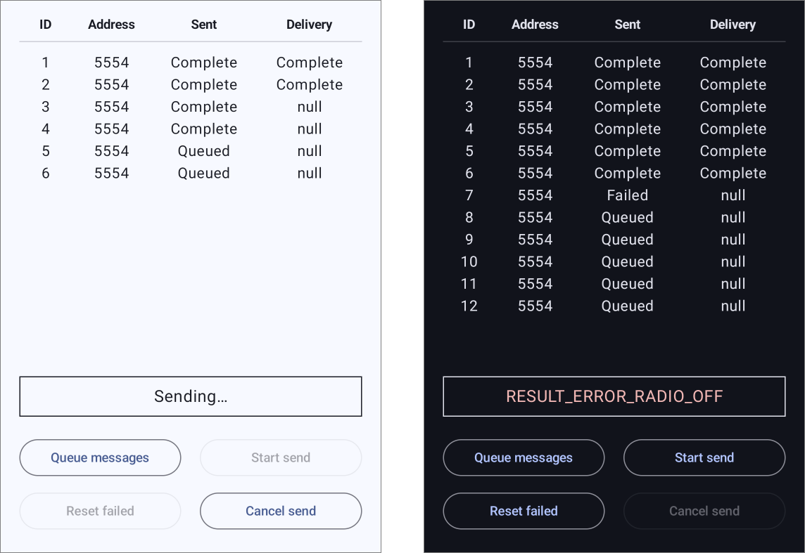

# SMS Sender

A complete working example to supplement the description of `SmsManager`'s
results mechanism given in
[this Stack Overflow answer](https://stackoverflow.com/a/24845193).

## Overview

The design is a modern update to the classic pattern that uses a `Service` to
send messages queued through a `ContentProvider` or local `SQLiteDatabase`.

The database\* here is managed through Room, and its schema comprises
a single entity `Message` and the corresponding DAO. On top of the usual CRUD
operations, `MessageDao` also provides a `Flow` on a query for the oldest queued
`Message`, greatly simplifying the send routine.

That routine is executed in a `Worker` which is started immediately for our
demonstration, but which could easily be scheduled for whenever, with whatever
constraints are needed.

The actual work for the send is handled in `SmsSendRepository`. We use Hilt to
maintain a singleton that we also inject into the statically-registered results
Receiver, allowing us to keep the overall logic in one place.

The UI is done in minimal Compose, and is basically just text logs with a few
buttons.

---

\* In order to keep this example relatively simple and easily
adaptable, the `database` classes currently serve as the data and the model too.
In a real app, you'll probably want to decouple and reorganize things to fit
your design.

### Fake delivery reports

The last thing to note is the fake delivery report mechanism for emulators of
API levels 30 and below, which don't offer that functionality. The feature is
contained in the debug build, and it only works when the test device is sending
to itself. It's nothing more than a regular `BroadcastReceiver` registered for
`SMS_RECEIVED` that checks each incoming message against those sent, and upon a
match, sends the same kind of broadcast you would get in a real run, complete
with valid result PDU attached as an extra.

This was mainly meant to make testing on the emulators more convenient, but
it should also work on a real device sending to itself, if the carrier doesn't
provide delivery reports. If it's running API level 31 or newer, though, you'll
have to remove the disabling attributes in [the debug manifest][debug-manifest],
and the SDK check in [the debug permissions][debug-permissions].

As is, the app assumes that it'll be running on a lone default emulator. That
is, it sends messages to hard-coded port number 5554.

 

## License

MIT License

Copyright (c) 2025 Mike M.

Permission is hereby granted, free of charge, to any person obtaining a copy of
this software and associated documentation files (the "Software"), to deal in
the Software without restriction, including without limitation the rights to
use, copy, modify, merge, publish, distribute, sublicense, and/or sell copies of
the Software, and to permit persons to whom the Software is furnished to do so,
subject to the following conditions:

The above copyright notice and this permission notice shall be included in all
copies or substantial portions of the Software.

THE SOFTWARE IS PROVIDED "AS IS", WITHOUT WARRANTY OF ANY KIND, EXPRESS OR
IMPLIED, INCLUDING BUT NOT LIMITED TO THE WARRANTIES OF MERCHANTABILITY, FITNESS
FOR A PARTICULAR PURPOSE AND NONINFRINGEMENT. IN NO EVENT SHALL THE AUTHORS OR
COPYRIGHT HOLDERS BE LIABLE FOR ANY CLAIM, DAMAGES OR OTHER LIABILITY, WHETHER
IN AN ACTION OF CONTRACT, TORT OR OTHERWISE, ARISING FROM, OUT OF OR IN
CONNECTION WITH THE SOFTWARE OR THE USE OR OTHER DEALINGS IN THE SOFTWARE.

  [debug-manifest]: app/src/debug/AndroidManifest.xml

  [debug-permissions]: app/src/debug/kotlin/com/gonodono/smssender/sms/SmsPermissions.kt